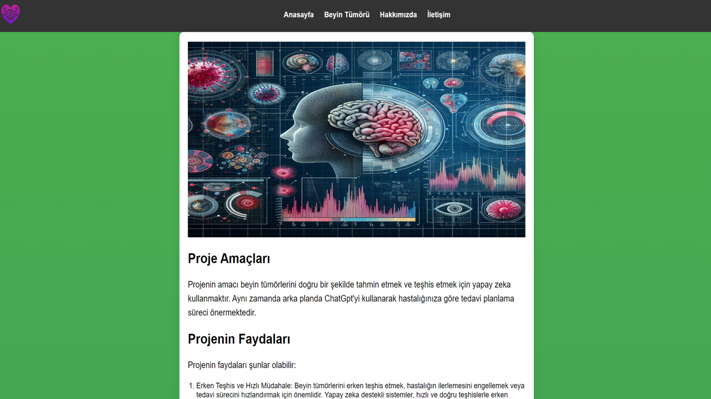
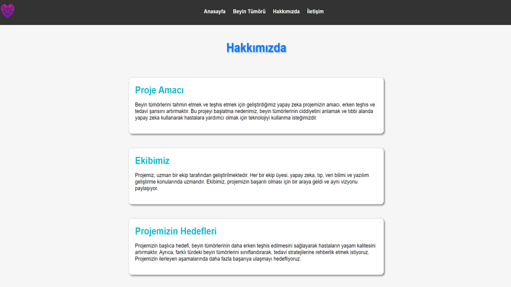
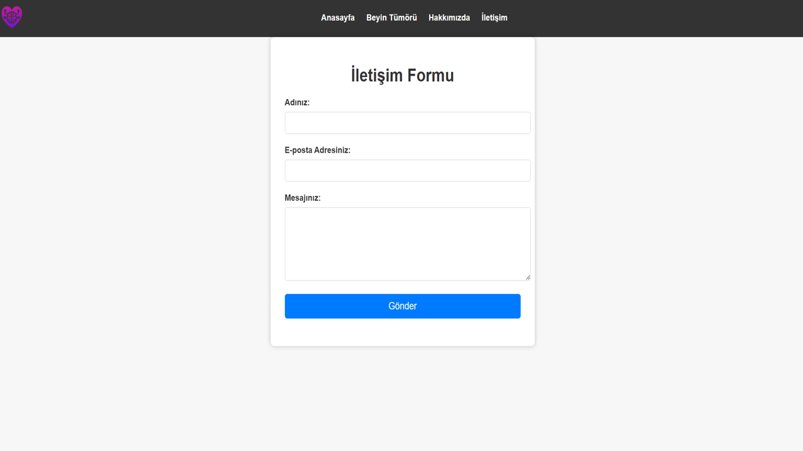
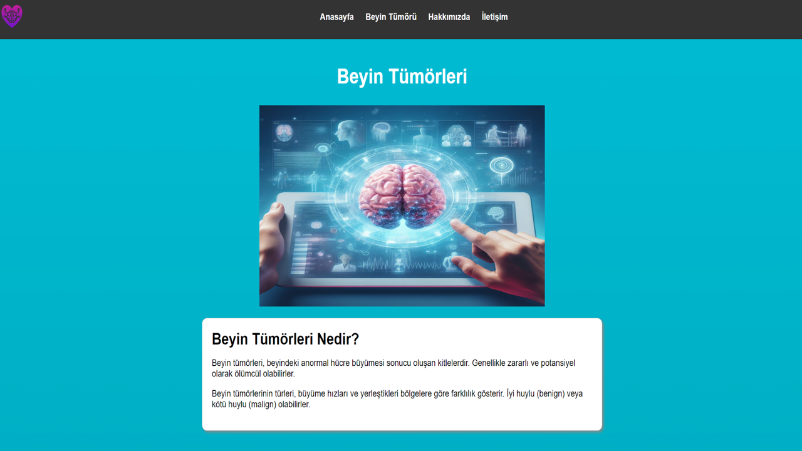
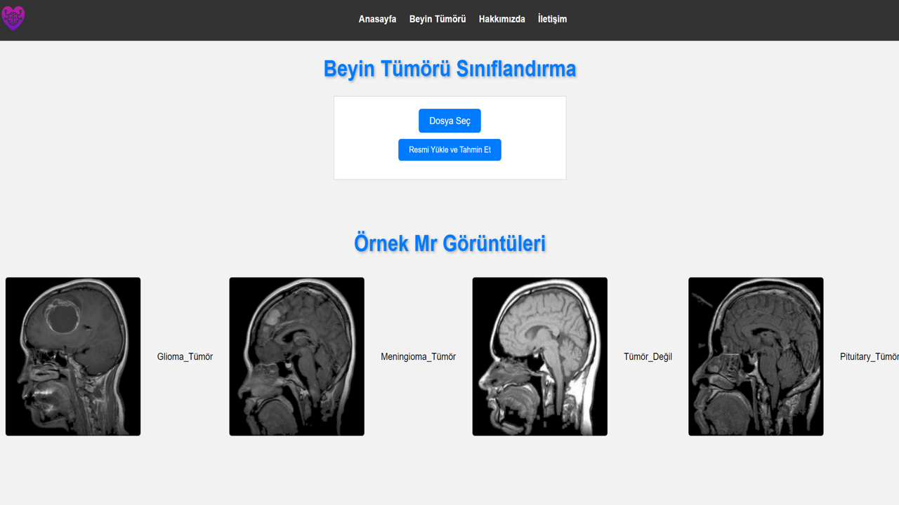
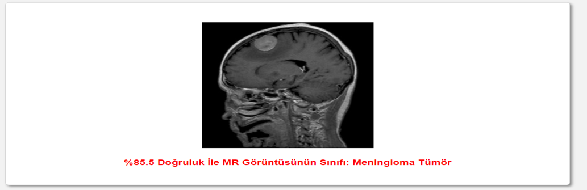
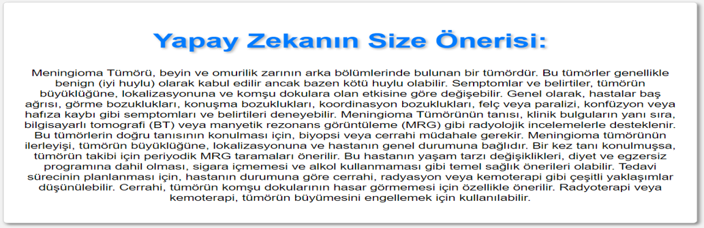

<!-- Başlık -->
# Beyin Tümörü Teşhisi ve Tedavi Planlaması için Yapay Zeka Destekli Web Uygulaması

[Proje Görüntüsü / Logo]

<!-- Açıklama -->
Bu projede beyin tümörlerini doğru bir şekilde tahmin etmek ve teşhis etmek amacıyla yapay zeka kullanılmaktadır. Aynı zamanda ChatGPT aracılığıyla hastalığa özgü tedavi planlama süreçleri sunulmaktadır.

<!-- Ana Başlıklar -->
## 🚀 Proje Amaçları

- Beyin tümörlerini erken aşamada tespit etmek ve doğru bir şekilde teşhis etmek.
- ChatGPT kullanarak hastalık sınıflandırılmasından sonra tedavi planlama sürecinde öneriler sunmak.
- TensorFlow ile yapay zeka modelini oluşturmak ve eğitmek.
- Flask teknolojisiyle web tabanlı kullanıcı dostu bir arayüz oluşturmak.

## ⭐ Özellikler

- **Anasayfa:** Projenin amacı, sağladığı faydalar, kullanım alanları gibi genel bilgiler.
- **Beyin Tümörü Tahmini:** Yüklenen MR görüntüsüne göre beyin tümörünü sınıflandırarak tedavi seçenekleri sunma.
- **Beyin Tümörü Bilgi:** Beyin tümörleriyle ilgili genel bilgiler.
- **Hakkımızda:** Projeye dair detaylı bilgiler.
- **İletişim:** Projenin sahibiyle iletişime geçme imkanı.

## 🛠️ Kullanılan Teknolojiler

- **TensorFlow:** Yapay zeka modelinin oluşturulması ve eğitimi için.
- **Flask:** Web tabanlı kullanıcı dostu arayüzün oluşturulması için.
- **Python:** Ana programlama dili olarak kullanılmıştır.
- **Veri Manipülasyonu:** Veri işleme süreçleri için kullanılmıştır.

## 📂 Nasıl Kullanılır?

1. Proje dosyalarını klonlayın veya indirin.
2. Gerekli bağımlılıkları yükleyin.
3. Uygulamayı başlatmak için gereken adımları izleyin.

## 🤝 Katkıda Bulunma

1. Fork'layın (<https://github.com/kullanici_adi/proje-adı/fork>)
2. Yeni bir dal oluşturun (`git checkout -b feature/fooBar`)
3. Değişikliklerinizi yapın (`git commit -am 'Add some fooBar'`)
4. Dalınıza push yapın (`git push origin feature/fooBar`)
5. Bir Pull Talebi oluşturun

## Uygulama Arayüzü
### - Anasayfa

### -Proje Hakkımızda Sayfası

### -İletişim Sayfası

### -Beyin Tümörü Bilgi Sayfası

### - Beyin Tümör Tahmin Sayfası

### - Beyin Tümörü Sınıflandırılması Ve GPT Tabanlı Kişileştirilmiş Tedavi Planı

